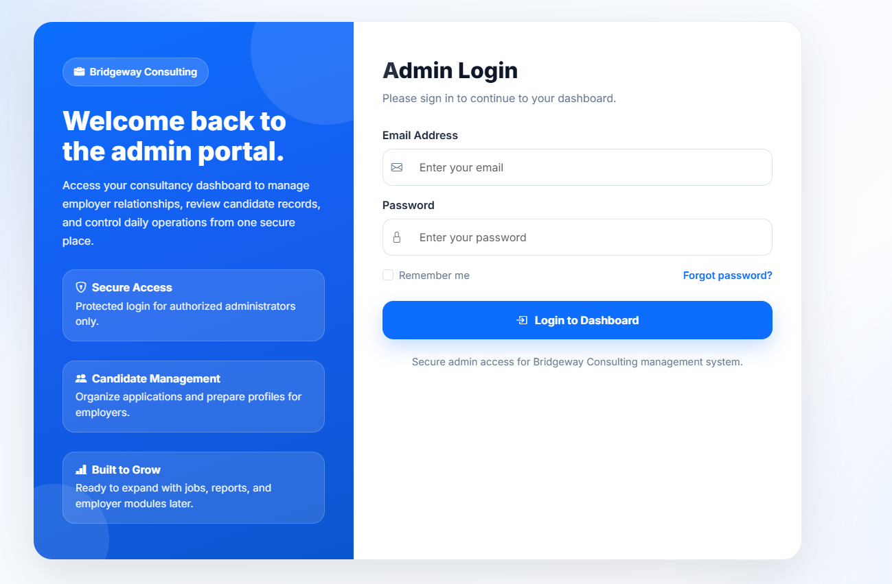
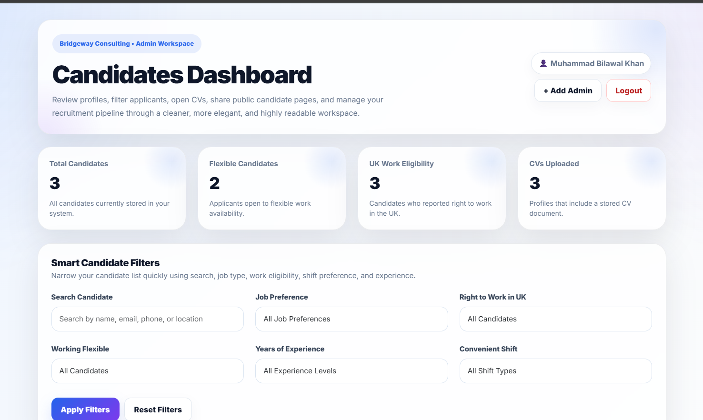
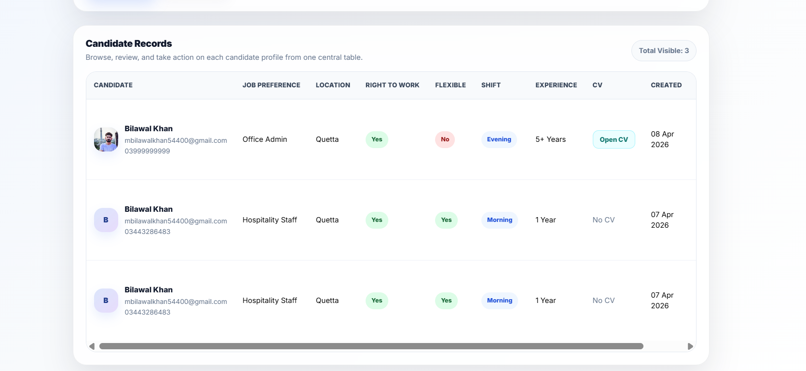
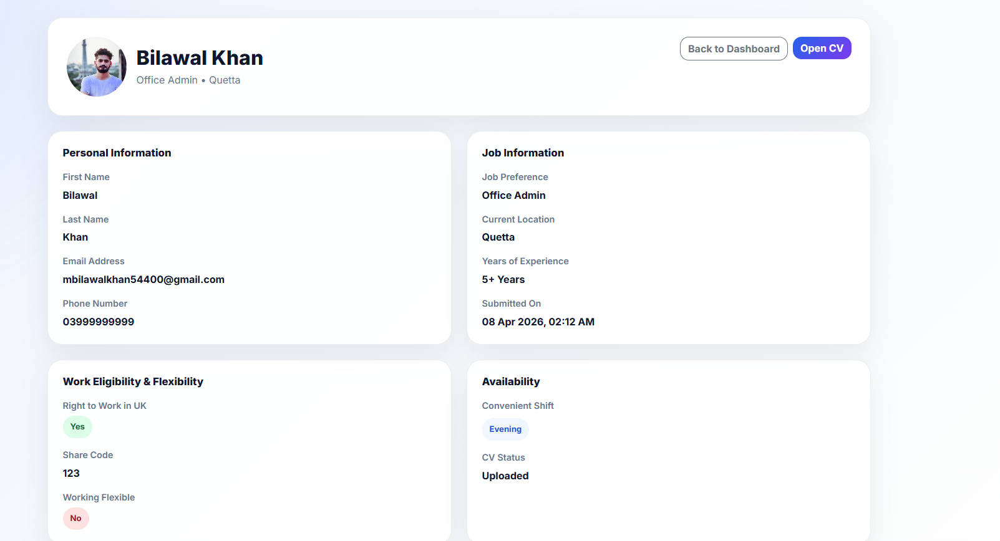
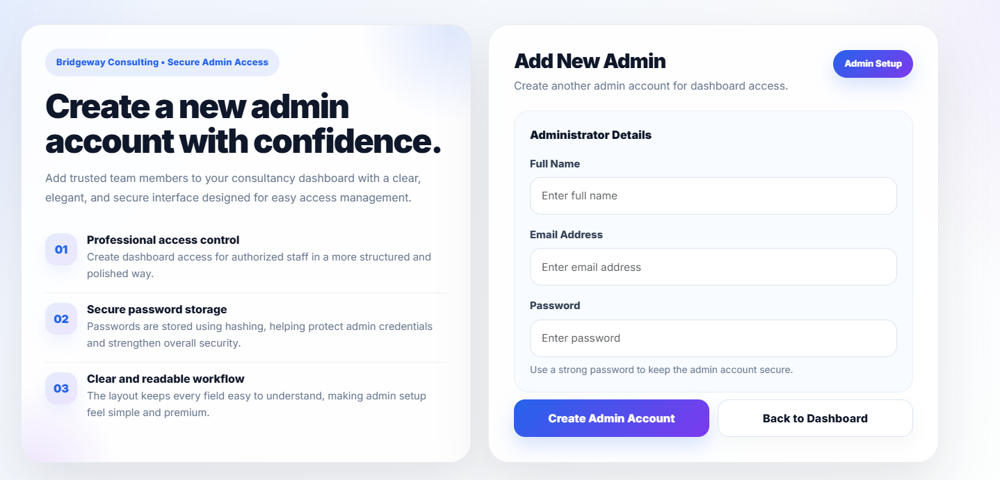
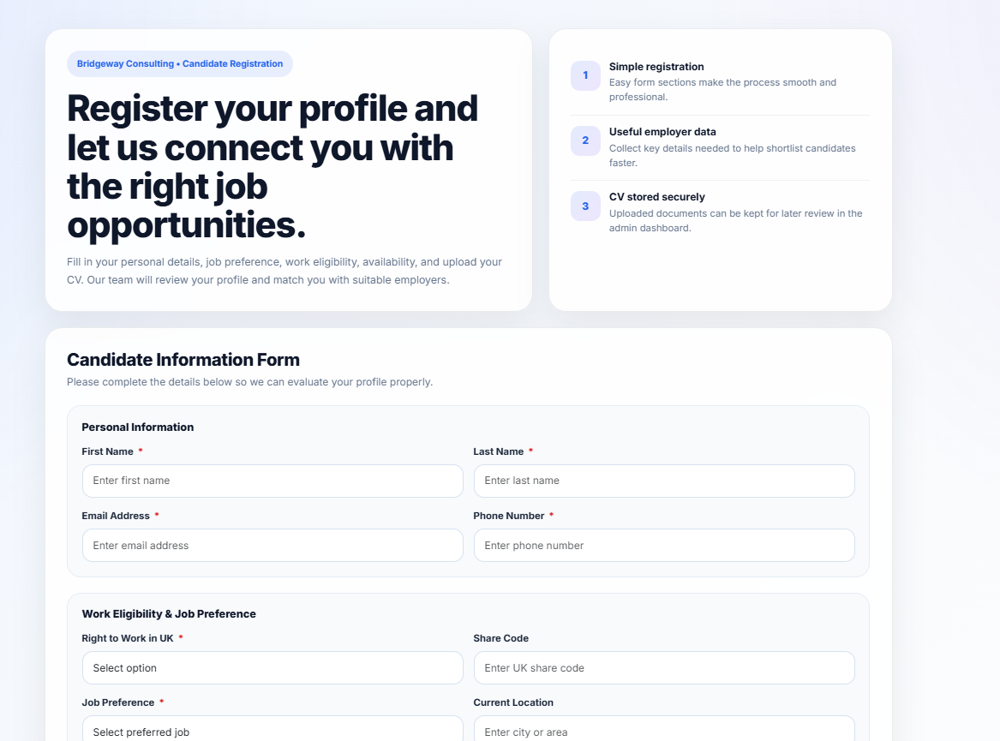

# 🚀 Bridgeway Consultancy Dashboard

> your consultancy dashboard to manage employer relationships, review candidate records, and control daily operations from one secure place

---

## 📸 Screenshots

<table align="center">
  <tr>
    <td></td>
    <td></td>
  </tr>
  <tr>
    <td></td>
    <td></td>
  </tr>
  <tr>
    <td></td>
    <td></td>
  </tr>
</table>

---

## 🧠 About the Project

Bridgeway Consultancy Dashboard is a web-based platform designed for consultancy firms to bridge the gap between employers and job seekers. It allows consultants to manage candidate profiles, track applications, and streamline the recruitment process through a centralized and user-friendly dashboard.

---


## ✨ Features

- 🔐 **Admin Authentication System**  
  Secure login system for consultancy administrators to access the dashboard.

- 👥 **Candidate Management**  
  View, organize, and manage all candidate profiles in a centralized system.

- 🔎 **Advanced Filtering & Search**  
  Filter candidates based on job preference, location, work eligibility, experience, and more.

- 📄 **Candidate Profile View**  
  Detailed profile view including personal information, job preferences, availability, and CV.

- 🔗 **Shareable Candidate Profiles**  
  Generate a unique shareable link for each candidate profile to send to employers.

- 🚫 **Link Activation / Deactivation**  
  Admin can enable or disable shared profile links at any time for security and control.

- 📊 **Dashboard Overview**  
  Summary cards showing total candidates, CV uploads, work eligibility stats, etc.

- ➕ **Admin Management**  
  Add and manage multiple admin users for the system.

- 📎 **CV Upload & Access**  
  Candidates can upload CVs which can be viewed directly from the dashboard and shared profiles.

- 🎨 **Modern & Responsive UI**  
  Clean, user-friendly interface designed for ease of use across devices.

---

## 🛠️ Tech Stack

### 🎨 Frontend
- HTML5  
- CSS3  
- Bootstrap 5 (Responsive UI Design)  
- JavaScript (Client-side interactions)  

### ⚙️ Backend
- PHP (Core backend logic & server-side processing)  

### 🗄️ Database
- MySQL (Data storage and management)  

### 🔧 Tools & Technologies
- Git & GitHub (Version control and collaboration)  
- XAMPP (Local development environment)  
- Font Awesome (Icons)  
- Bootstrap Components (UI elements)  

---

## ⚙️ Installation

> No complex setup required — just configure the database and you're ready to go.

Follow these steps to run the project locally:

---

### 1. Clone the Repository

```bash
git clone https://github.com/your-username/your-repo-name.git
cd your-repo-name

2. Setup Local Server

Make sure you have a local server installed such as:

XAMPP
WAMP
LAMP

Now move the project folder to:

htdocs (for XAMPP)
www (for WAMP)

3. Setup Database
Open phpMyAdmin
Create a new database (e.g., bridgeway_db)
Import the SQL file located in:
/database/bridgeway.sql

4. Set Up Config.php File
Sample Config File is Given below
<?php
define('DB_HOST', 'localhost');
define('DB_NAME', 'db_name');
define('DB_USER', 'db_user');
define('DB_PASS', 'db_pass');
?>

5. Run the Project

Open your browser and go to:

http://localhost/your-project-folder

✅ Done!

The project should now be running successfully on your local server.